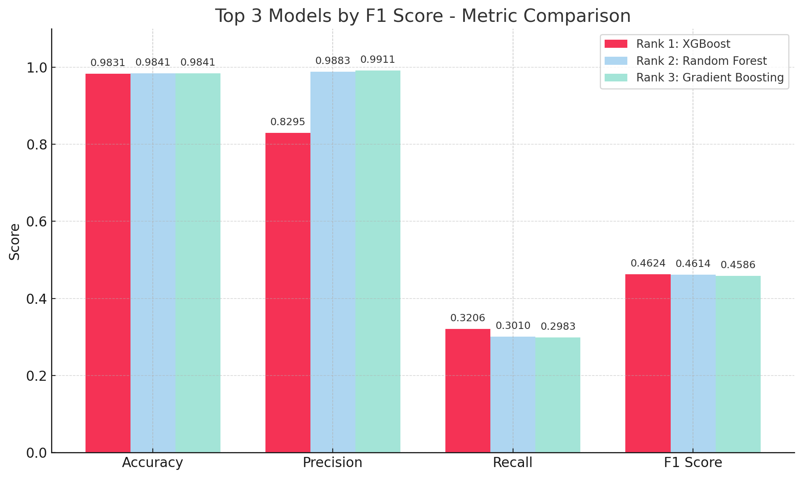

# 2. 모델 학습 결과서

## 최종 모델 선정을 위한 평가지표와 그에 대한 설명

- **F1-score**: 클래스 불균형 문제가 존재하며, 프로젝트의 목적상 오탐과 미탐을 고루 고려하기 위해 f1-score를 최종 모델을 선정하기 위한 평가지표로 사용<br>
- **AP-score/AUC-ROC-score**: 모델들의 전체적인 이진 분류 성능을 판단하기 위해 사용<br>
- **Threshold Tuning**: Precision-Recall 간 trade-off를 조정하기 위해 임계값 조정 수행

<br/><br/>

## 최종 선정된 모델에 대한 설명

- **선정 모델**: XGBoost
- **최종 하이퍼파라미터**
  ```json
  {
    "subsample": 1.0,
    "n_estimators": 200,
    "max_depth": 4,
    "learning_rate": 0.2,
    "gamma": 0,
    "colsample_bytree": 1.0
  }
  ```
- **성능 요약**:
  - Precision: 0.7565
  - Recall: 0.3908
  - F1 Score: 0.5153
  - Threshold 최적값: **0.30**
<br/><br/>
## 학습 과정 기록
<br/>
1) 전체 모델 중 후보 모델 고르기<br>
- 데이터셋이 매우 큰 관계로(260만 개) trainset, testset의 크기를 0.02로 설정하여 모델 선정 과정 진행<br>
- 성능 비교표<br>

| 모델               | Accuracy | Precision | Recall  | F1 Score |
|--------------------|----------|-----------|---------|----------|
| Logistic Regression | 0.9709   | 0.2851    | 0.1897  | 0.2278   |
| KNN Neighbors       | 0.9494   | 0.1681    | 0.3126  | 0.2186   |
| Decision Tree       | 0.9662   | 0.3003    | 0.3722  | 0.3324   |
| Random Forest       | 0.9841   | 0.9883    | 0.3010  | 0.4614   |
| Gradient Boosting   | 0.9841   | 0.9911    | 0.2983  | 0.4586   |
| XGBoost             | 0.9831   | 0.8295    | 0.3206  | 0.4624   |
<br/>
2) 후보 모델 중 최종 모델 고르기<br>
- 평가지표로 선정된 f1-score가 유사한 Random Forest, Gradient Boosting, XGBoost 모델에 대해 RandomizedSearchCV를 이용한 하이퍼 파라미터 튜닝<br>
- F1-score, Confusion Matrix, PR-curve, ROC-curve 를 비교하여 최종 모델로 XGBoost 선정<br>
  
<br/>
3) 데이터셋 불균형 해소하기<br>
-  이진 분류의 타겟 클래스 비율이 2% 에 그친다는 문제점을 해소하기 위해 학습 데이터 셋의 크기를 증가시켜가며 f1-score 값 튜닝<br>
  
- SMOTE 적용은 train set에만 적용, test set은 원본 데이터를 그대로 사용함으로써 평가 신뢰도 확보<br>
<br/>
4) 최종 모델 XGBoost의 Threshold 조정 <br>
- 데이터셋의 불균형이 심한 탓에 PR-curve의 recall = 0.3 부근에서 급격한 감소 발생<br>
  
- threshold 별 precision, recall, f1-score를 비교해 최적 threshold 값 찾기<br>
  
- Threshold 별 평가 지표표<br/>
| Threshold	|  Precision	|  Recall	|  F1 Score
|-----------|----------|-----------|---------|
| 0.10	|  0.3005	|  0.6161	|  0.4040  |
| 0.15	|  0.4196	|  0.5336	|  0.4698  |
| 0.20	|  0.5387	|  0.4707	|  0.5024  |
| 0.25	|  0.6518	|  0.4257	|  0.5150  |
| 0.30	|  0.7565	|  0.3908	|  0.5153 ← 최적 F1  |
| 0.35	|  0.8343	|  0.3665	|  0.5093  |
| 0.40	|  0.8945	|  0.3488	|  0.5019  |
| 0.45	|  0.9372	|  0.3354	|  0.4940  |
| 0.50	|  0.9656	|  0.3263	|  0.4878  |
<br/>
5) 모델 저장하기<br>
- 최종 학습된 모델과 전처리기를 pickle로 저장하여 새로운 데이터 예측 시 불러와 사용 
